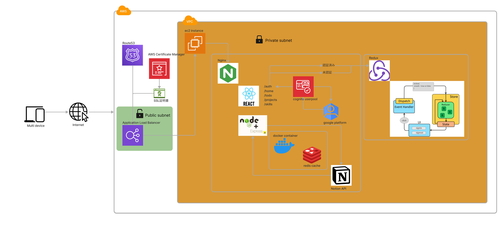

# バックエンド

---

- ### 目的

  ##### ハンズオン学習

  ウェブアプリケーションを一気通貫で作成することで、理解が浅い分野を細部まで調べる機会を得る。また資格勉強だけでは得ることができない体系的な知識を学ぶ。

  ##### ポートフォリオサイト

  開発や研修等に関わるスケジュールを todo で管理、今まで経験したプロジェクトの記録、今まで使用した技術スタックの記録を視覚的にまとめ自分で振り返る、または他者にアピールすることができるポートフォリオサイトの作成。

  ##### アピール

  ポートフォリトサイトを作成することで、自分の技術力が形として残り他者から評価を受ける機会を増やすことができる。

- ### 要件
  上記の目的を考慮し今回作成するアプリケーションの要件を以下に記載する。
  - 汎用性が高くモダンな以下の技術スタックを採用する。
    - react
    - tailwindcss
    - node.js
    - RESTAPI
    - docker
  - notion の DB 機能を使用した to-do アプリを利用する。
  - 認証機能を実装しセキュリティを堅牢にする。
  - フォーム機能を実装する。
- ### 実装

  ##### システムアーキテクチャ図

  

  - ##### serverfolio

    
    

    ###### routes

      

    ###### controller

      
      
      

    ###### services

      

- ### 導入
  > ```
  > git clone https://github.com/yoshik-00/reactfolio.git
  >
  > npm install
  >
  > npm run dev
  > ```

---
